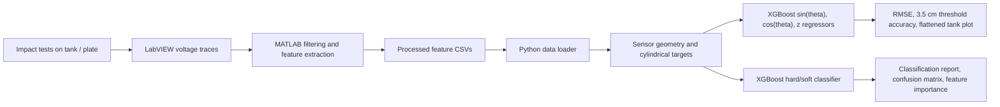

# Deep Learning Approach to Impact Detection in Sensorized Panels

[](https://github.com/tuntharm/FYP/actions/workflows/ci.yml)

Research code, processed sample data, and documentation for an Imperial College London final-year project on passive impact detection for structural health monitoring (SHM).

The project studies a sensorised cylindrical composite hydrogen-tank demonstrator instrumented with piezoelectric transducers. Impact waveforms are converted into interpretable signal features, then XGBoost models infer both impact location and hard/soft impact class. The public repository is organised as a compact evidence pack rather than a raw laboratory data dump.

## Why This Matters

Composite tanks, panels, and other safety-critical lightweight structures can experience low-velocity impacts that are hard to inspect visually. This project explores a practical SHM workflow for turning passive PZT voltage traces into:

- a localised impact point on a curved surface,
- a hard/soft impact-type classification,
- a reproducible feature and model pipeline that can be adapted to other sensor layouts.

The current implementation is a research prototype, not a certified inspection product. It is useful as a signal-processing and ML reference for impact localisation, dataset design, feature extraction, and SHM consultancy discussions.

## Report-Backed Results

The headline metrics below are quoted from the submitted final report, now committed at [`docs/report/FYP_02048996.pdf`](docs/report/FYP_02048996.pdf). The public sample commands reproduce the workflow on compact processed CSVs; they are not claimed to exactly reproduce the full report tables because the raw/full A/B/C experiment folders remain access-controlled.

| Evaluation setting | Localisation RMSE | Threshold accuracy | Classification accuracy | Runtime |
| --- | ---: | ---: | ---: | ---: |
| XGBoost, B+C Top, 10-fold CV | 1.07 +/- 0.23 cm | 93.86 +/- 2.25% within 3.5 cm | 99.36 +/- 1.00% | 58.06 s localisation, 4.89 s classification |
| ConvXGB, B+C Top, 10-fold CV | 2.01 +/- 0.39 cm | 91.00 +/- 3.59% | 99.63 +/- 0.55% | 187.99 s localisation, 49.57 s classification |
| ANN, B+C Top, 10-fold CV | 3.83 +/- 0.39 cm | 77.60 +/- 4.96% | 96.04 +/- 1.92% | 159.30 s localisation, 80.13 s classification |

See [`results/README.md`](results/README.md) for the report table traceability and [`comparison/README.md`](comparison/README.md) for model comparisons and interpretation.

## Technical Workflow



The core modelling choice is to avoid direct angular regression across the `-pi/pi` discontinuity. The localisation target is split into three regressions: `sin(theta)`, `cos(theta)`, and axial `z`; the predicted angle is reconstructed with `atan2`. Error is measured on the unwrapped cylindrical surface using radius `11.55 cm`.

## Repository Map

- [`src/fyp_impact/`](src/fyp_impact/) - reusable Python package for data loading, geometry, XGBoost models, metrics, and plotting.
- [`scripts/`](scripts/) - runnable training, inference, row-shuffled validation, grouped validation, tuning, optional ANN, and public demo entrypoints.
- [`data/processed/tank/16april/`](data/processed/tank/16april/) - compact processed tank CSV sample for public workflow checks.
- [`matlab/`](matlab/) - original MATLAB signal-processing and feature-extraction stage for tank and plate data.
- [`docs/methodology/`](docs/methodology/) - XGBoost design, feature extraction, validation limits, and reproducibility notes.
- [`results/`](results/) - report-backed metrics and public-sample output expectations.
- [`comparison/`](comparison/) - XGBoost, ConvXGB, and ANN comparison notes.
- [`docs/governance/`](docs/governance/) - limitations, data governance, and collaboration/pilot framing.
- [`notebooks/`](notebooks/) - Google Drive / Colab provenance without committing bulky notebook outputs.
- [`assets/plots/`](assets/plots/) - preserved figures from development and report preparation.
- [`tests/`](tests/) - lightweight pytest coverage for loader, geometry, and metrics logic.

## Setup

Use Python 3.11 if available. The Colab notebook environment used Python 3.11.12 with XGBoost 2.1.4, NumPy 2.0.2, Pandas 2.2.2, and scikit-learn 1.6.1; the requirements file keeps broader compatible ranges for local installs.

```bash
python -m venv .venv
source .venv/bin/activate
pip install -r requirements.txt
```

On Windows PowerShell:

```powershell
py -3 -m venv .venv
.\.venv\Scripts\Activate.ps1
python -m pip install -r requirements.txt
```

For the optional TensorFlow ANN baseline:

```bash
pip install -r requirements-optional.txt
```

## Reproduce the Public XGBoost Workflow

Train localisation and hard/soft classification on the bundled processed tank sample:

```bash
python scripts/train_xgboost.py --data-dir data/processed/tank/16april --test-loc top --output-dir outputs/xgboost
```

Run 10-fold validation on the same sample:

```bash
python scripts/cross_validate.py --data-dir data/processed/tank/16april --folds 10 --test-loc top
```

Run grouped validation as a stricter stress test that holds related groups out together:

```bash
python scripts/grouped_validate.py --data-dir data/processed/tank/16april --group-by Loc --folds 5 --test-loc top
```

After training, run inference from the saved model JSON files:

```bash
python scripts/predict_xgboost.py --data-dir data/processed/tank/16april --model-dir outputs/xgboost/models --output-csv outputs/xgboost/inference_predictions.csv --test-loc top
```

The training command writes:

- `metrics.json`
- `predictions_localisation.csv`
- `predictions_classification.csv`
- `flattened_tank_predictions.png`
- `confusion_matrix.png`
- feature-importance plots
- XGBoost JSON model files under `outputs/xgboost/models/`

PowerShell users can run the same public demo with:

```powershell
.\scripts\run_public_demo.ps1
```

The PowerShell demo uses reduced defaults for speed; the explicit commands above show the report-style public defaults.

## Data Scope

The committed CSVs are processed feature tables, not raw voltage traces. The loader accepts one or more `--data-dir` values and reads only CSV files directly inside each directory. This makes A/B/C combinations explicit and avoids accidental recursive mixing:

```bash
python scripts/train_xgboost.py --data-dir data/processed/tank/16april --data-dir data/processed/tank/16april/A
```

The larger project folders are access-controlled unless the owner changes sharing permissions:

- [Main project and Colab folder](https://drive.google.com/drive/folders/1eV1nWm934i87P8r-wzCiRNaIlF0wvnsz)
- [A/B/C processed data folder](https://drive.google.com/drive/folders/1XZoWibuwQfjbE8UywY4qdUQTbJVWTcx2)
- [`16april` processed CSV folder](https://drive.google.com/drive/folders/1fUreyAiRBNO5NepapWqen2SD_-f8QQnH)

See [`data/README.md`](data/README.md) for the public data dictionary, row counts, and checksums.

## Method Notes

The feature pipeline extracts per-sensor time of arrival, peak amplitude, signal energy, and impact force from passive waveforms. Tank locations are mapped to cylindrical `(theta, z)` targets, and eight sensor positions are appended as fixed geometry features.

For deeper detail:

- [`docs/methodology/feature-extraction.md`](docs/methodology/feature-extraction.md) documents the MATLAB raw-signal-to-CSV lineage.
- [`docs/methodology/xgboost.md`](docs/methodology/xgboost.md) documents the XGBoost modelling strategy and hyperparameters.
- [`docs/methodology/reproducibility.md`](docs/methodology/reproducibility.md) documents what can and cannot be reproduced from the public sample.
- [`docs/governance/limitations.md`](docs/governance/limitations.md) documents deployment limits, leakage risks, and data-access assumptions.
- [`docs/governance/collaboration.md`](docs/governance/collaboration.md) frames pilot use cases and what a partner evaluation should check next.

## Status

No open-source license has been selected yet, so the code and data should be treated as view-only unless permission is granted by the repository owner. See [`NOTICE.md`](NOTICE.md), [`SECURITY.md`](SECURITY.md), and [`CITATION.cff`](CITATION.cff) for usage, contact, and citation metadata.
