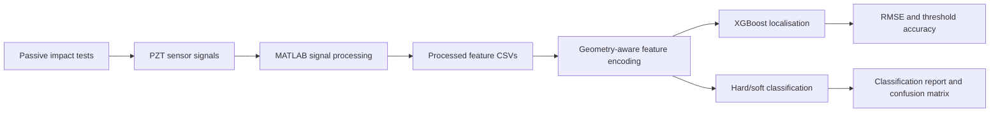

# Deep Learning Approach to Impact Detection in Sensorized Panels

This repository contains the code and processed sample data behind my Imperial College London final-year project on impact localisation and classification for structural health monitoring (SHM).

The project studies passive PZT sensing on a cylindrical composite hydrogen tank. Instead of relying on a full physics-based wave model, it extracts waveform features such as time of arrival, amplitude, signal energy, and force, then trains machine-learning models to infer impact position and impact type.

## Results Snapshot

From the final report:

- Localisation: XGBoost achieved 1.07 cm RMSE under 10-fold cross-validation.
- Threshold accuracy: 93.9% of predictions fell within a 3.5 cm spatial error threshold.
- Classification: hard versus soft impact classification reached 99.4% accuracy.
- Runtime: the XGBoost workflow was fast enough for practical offline evaluation, with classification and localisation runtimes reported in seconds on the test workflow.

These headline figures come from the final report and the cloud/local experiments. Re-running the scripts here on the included sample data may produce slightly different values because the public repo intentionally contains only compact processed CSVs rather than every raw experiment asset.

## Workflow



## Repository Layout

- `src/fyp_impact/` - reusable Python package for data loading, geometry features, models, metrics, and plotting.
- `scripts/` - runnable training, cross-validation, tuning, and optional ANN baseline entrypoints.
- `data/processed/tank/16april/` - compact processed CSV sample used by the public reproducibility commands.
- `matlab/tank/` and `matlab/plate/` - MATLAB signal-processing and feature-extraction scripts from the original project.
- `assets/plots/` - report/development plots preserved as visual reference.
- `tests/` - lightweight pytest coverage for the reusable Python logic.

## Setup

```bash
python -m venv .venv
source .venv/bin/activate
pip install -r requirements.txt
```

For the optional TensorFlow ANN baseline:

```bash
pip install -r requirements-optional.txt
```

## Reproduce the XGBoost Sample Run

Train localisation and hard/soft classification on the included processed tank sample:

```bash
python scripts/train_xgboost.py --data-dir data/processed/tank/16april --test-loc top --output-dir outputs/xgboost
```

Run 10-fold validation:

```bash
python scripts/cross_validate.py --data-dir data/processed/tank/16april --folds 10 --test-loc top
```

The scripts save metrics and plots under `outputs/`, including:

- `metrics.json`
- `flattened_tank_predictions.png`
- feature-importance plots
- `confusion_matrix.png`
- `cross_validation_metrics.json`

## Data Notes

The bundled CSVs are processed feature tables, not raw sensor recordings. The loader accepts repeated `--data-dir` arguments and only reads CSV files directly inside each folder. This makes A/B/C combinations explicit and avoids accidentally mixing nested experimental variants.

The larger Google Drive folders used during the project are access-controlled unless the owner changes sharing permissions:

- [Main project and Colab folder](https://drive.google.com/drive/folders/1eV1nWm934i87P8r-wzCiRNaIlF0wvnsz)
- [A/B/C processed data folder](https://drive.google.com/drive/folders/1XZoWibuwQfjbE8UywY4qdUQTbJVWTcx2)
- [`16april` processed CSV folder](https://drive.google.com/drive/folders/1fUreyAiRBNO5NepapWqen2SD_-f8QQnH)

Selected Colab notebooks:

- [unitcircle_XGBtrain.ipynb](https://colab.research.google.com/drive/1Rxi9MhHp9W4_14hnJDhh1dj4H2ndVi_O)
- [main_XGBtrain.ipynb](https://colab.research.google.com/drive/1Xd44GR7gjjo9EV3DRD9GtuzAgg8PXUty)
- [main_ConvXGBtrain.ipynb](https://colab.research.google.com/drive/1XMeru_X4vyV56MFSewB4WZdJEPNcG7cL)
- [unitcircle_ANNtrain.ipynb](https://colab.research.google.com/drive/1HBLRAsPXaChXX9bRE8JD5UXbOlMaZgLz)

## Model Details

The main localisation model trains three XGBoost regressors for `sin(theta)`, `cos(theta)`, and `z`. Angular position is reconstructed with `atan2`, which avoids discontinuities at the `-pi`/`pi` boundary. Localisation error is evaluated on the unwrapped cylindrical surface using the tank radius.

The classification model trains an XGBoost binary classifier on waveform-derived features to distinguish soft and hard impacts. The optional ANN script is retained as a comparison baseline, but XGBoost is the primary public workflow.

## Notes

- The full final report PDF is not committed because it contains submission metadata and is better cited separately.
- No open-source license has been selected yet. Please contact the repository owner before reusing the work beyond viewing or evaluation.
