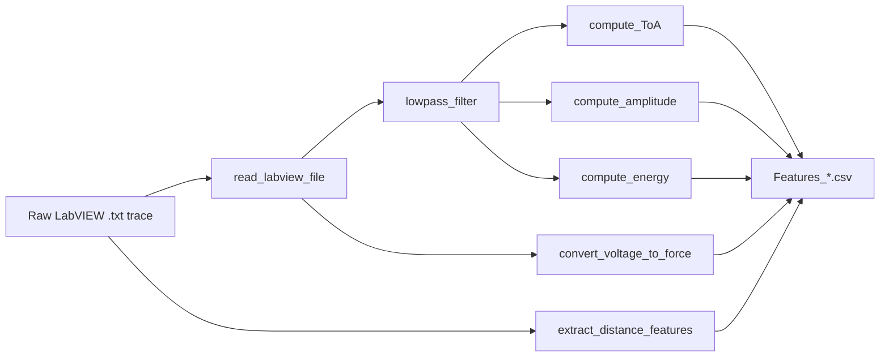

# Feature Extraction Methodology

The repository keeps MATLAB feature extraction separate from Python model training. MATLAB turns raw LabVIEW impact traces into processed feature CSVs; Python consumes those CSVs for reproducible model training and evaluation.

## Raw-to-CSV Lineage

## Tank Pipeline

Entry point: [`../../matlab/tank/datagen.m`](../../matlab/tank/datagen.m)

The tank script:

1. scans case folders under a raw tank-data directory,
2. parses impact type from folder names such as `stl`, `sil`, `rub`, and `srub`,
3. parses probe scaling from `p<number>`,
4. sorts impact files by `l<number>` location,
5. reads LabVIEW time, PZT sensor, and force channels,
6. converts force voltage into Newtons,
7. extracts waveform features for each sensor,
8. maps `Loc` to cylindrical `theta` and `z`,
9. writes one `Features_<case>.csv` table per case.

The legacy script still contains local absolute paths in its input section. Treat those lines as operator-specific configuration, not as portable source assumptions. The documented portable contract is the CSV schema consumed by Python.

## Features

| Feature | Source function | Description |
| --- | --- | --- |
| `ToA_S1` to `ToA_S8` | `compute_ToA.m` | Time of arrival from filtered signal using the vectorised AIC method; values are normalised by subtracting the earliest sensor ToA within the event. |
| `Amplitude_S1` to `Amplitude_S8` | `compute_amplitude.m` | Dominant signed peak after filtering; tank pipeline normalises by maximum absolute amplitude across sensors. |
| `SignalEnergy_S1` to `SignalEnergy_S8` | `compute_energy.m` | Integrated signal energy; hard impacts use squared signal energy, soft impacts use Hilbert-envelope energy. |
| `Force_N` | `convert_voltage_to_force.m` | Peak impact force converted from voltage using sensitivity `2.75 mV/N`, gain `1`, and impact-head probe scaling. |
| `Loc`, `theta`, `z` | `extract_distance_features.m` | Discrete impact location and cylindrical coordinates for the tank geometry. |
| `Impact_Type` | post-processing / Python loader input | Binary hard/soft class label used by the classifier. |

## Filtering and Sampling Assumptions

The tank low-pass filter uses a fourth-order Butterworth filter with a `30 kHz` upper cutoff. `compute_energy.m` uses `dt = 1 / 2e6`, matching the assumed `2 MHz` sampling rate used during feature generation.

## Tank Geometry

Tank locations are mapped to eight angular bands and five axial bands:

- angular positions: `0`, `pi/4`, `pi/2`, `3pi/4`, `pi`, `-3pi/4`, `-pi/2`, `-pi/4`,
- axial positions: `7.5`, `15`, `22.5`, `30`, `37.5 cm`,
- cylinder radius used in Python metrics: `11.55 cm`.

The Python package appends sensor geometry with four sensors at `z=0` and four at `z=45 cm`, each distributed at `0`, `pi/2`, `pi`, and `3pi/2`.

## Plate Pipeline

Entry point: [`../../matlab/plate/datagen_plate.m`](../../matlab/plate/datagen_plate.m)

The plate scripts are preserved as the earlier flat-panel feature-extraction stage. They map impact locations to planar `Loc_X` and `Loc_Y` coordinates, then extract the same core feature families. The public Python training entrypoints focus on the tank CSV schema.

## Practical Notes for Reuse

To adapt this pipeline to a new structure:

1. update the raw reader for the new acquisition format,
2. define the sensor layout and coordinate map,
3. choose filtering and ToA parameters appropriate to the material and sampling rate,
4. emit the same feature-family schema or update `src/fyp_impact/data.py`,
5. use grouped validation if samples from the same impact/case are correlated.
